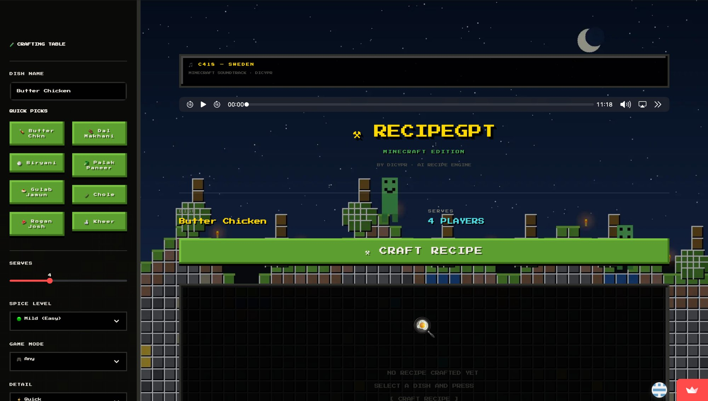

# ⚒ RecipeGPT — Minecraft Edition

> *An AI-powered Indian recipe generator with a full Minecraft-themed UI, live music, and pixel art scenery.*
> **Built by [Dicypr](https://github.com/dicypr)**


--
---

## 🌐 Live Demo

| Platform | Link |
|---|---|
| 🎮 Streamlit App | [dicyprcooks.streamlit.app](https://dicyprcooks.streamlit.app) |
| 🌍 GitHub Pages | [dicypr.github.io/recipegpt](https://dicypr.github.io/recipegpt) |

---

## 🎮 What Is This?

**RecipeGPT Minecraft Edition** is an AI recipe generator that looks and feels like Minecraft. Type any Indian dish name, hit **CRAFT RECIPE**, and watch a detailed recipe stream out in real time — all while C418's Sweden plays in the background and creepers roam a pixel-art night landscape behind the UI.

---

## ✨ Features

- 🌙 **Full Minecraft night scene** — pixel art background with stars, moon, terrain, creepers, trees and torches
- 🎵 **C418 Sweden soundtrack** — the iconic Minecraft music plays in the browser
- 🍛 **AI recipe generation** — powered by NVIDIA NIM (Llama 3.1 70B)
- ⚡ **Streaming output** — recipes appear token by token like a typewriter
- 🧪 **Crafting Table sidebar** — select dish, spice level, serves, dietary mode and detail level
- 💎 **Quick picks** — one-click buttons for 8 popular Indian dishes
- 📋 **Copy recipe** — copy generated recipe to clipboard instantly
- 🎮 **Press Start 2P font** — authentic pixel art typography throughout

---

## 🍛 Sample Dishes

| Dish | Category |
|---|---|
| Butter Chicken | North Indian |
| Dal Makhani | Punjabi |
| Hyderabadi Biryani | Hyderabadi |
| Palak Paneer | North Indian |
| Gulab Jamun | Dessert |
| Chole Masala | Punjabi |
| Rogan Josh | Kashmiri |
| Kheer | Dessert |

---

## 📁 Repository Structure

```
recipegpt/
├── 📓 notebooks/
│   ├── nanoGPT_Indian_Recipes_v2.ipynb   ← Train your own model (optional)
│   └── RecipeGPT_TestSuite.ipynb         ← Evaluate model quality
│
├── 🌐 site/
│   └── index.html                         ← Standalone Minecraft site (GitHub Pages)
│
├── 🚀 streamlit/
│   ├── app.py                             ← Main Streamlit app
│   ├── requirements.txt                   ← Python dependencies
│   └── sweden.mp3                         ← C418 Sweden soundtrack
│
├── 🔧 backend/
│   ├── server.js                          ← Node.js proxy server
│   └── package.json
│
├── .github/workflows/deploy.yml           ← Auto-deploy to GitHub Pages
├── README.md
├── SETUP.md
└── LICENSE
```

---

## 🚀 Deploy Your Own

### 1. Fork this repo
Click **Fork** at the top right of this page.

### 2. Add your NVIDIA API key to Streamlit
1. Go to [share.streamlit.io](https://share.streamlit.io)
2. Connect your forked repo
3. Main file: `streamlit/app.py`
4. Click **Deploy**
5. Go to **Manage App → Edit Secrets** and add:
```toml
NVIDIA_API_KEY = "nvapi-your-key-here"
```

### 3. Get a free NVIDIA API key
1. Go to [build.nvidia.com](https://build.nvidia.com)
2. Sign up free — get **1000 free credits**
3. Click your profile → **API Keys → Generate Key**

---

## 🧠 The AI Model

This app uses **NVIDIA NIM** with **Meta Llama 3.1 70B Instruct** to generate recipes. The model receives a structured system prompt that forces it to output recipes in a consistent format with:

- Exact ingredient quantities
- Numbered method steps
- Professional chef tips

Optionally you can also train your own **nanoGPT** model from scratch using the included Colab notebooks — same architecture as Andrej Karpathy's "Let's Build GPT" lecture.

---

## 🛠 Tech Stack

| Layer | Technology |
|---|---|
| Frontend | Streamlit + CSS (Press Start 2P font) |
| Background | PIL-generated pixel art (WebP base64) |
| Music | C418 Sweden (MP3, st.audio) |
| AI | NVIDIA NIM — Llama 3.1 70B |
| Model (optional) | nanoGPT trained from scratch |
| Deployment | Streamlit Cloud (free) |
| Site | GitHub Pages |

---

## 📄 License

MIT License — see [LICENSE](LICENSE)

> *Minecraft is a trademark of Mojang Studios. This is an independent fan project not affiliated with Mojang or Microsoft. C418 music used for fan/educational purposes.*

---

*Made with ❤️ and too many late nights by [Dicypr](https://github.com/dicypr)*
